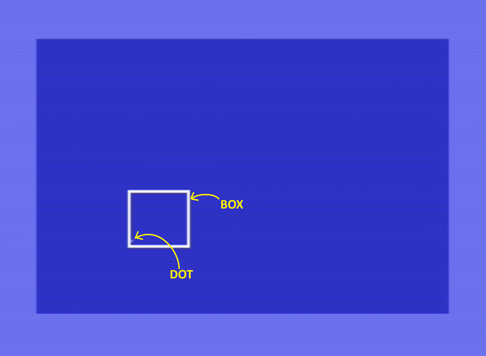
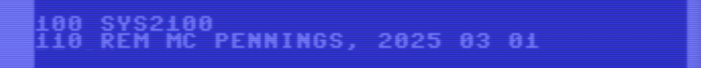
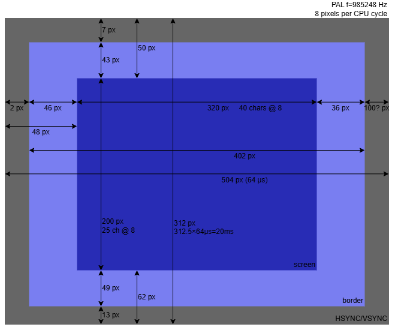

# C64-bouncingbox

A C64 (Commodore 64) Turbo Macro Pro assembler program that bounces a box on the screen.


## Introduction

A friend bought me an "old" Commodore 64.
So I stepped up my YouTube time for C64 videos.
I like Robin's [8-Bit Show And Tell](https://www.youtube.com/@8_Bit) channel,
and one day I stumbled on his [Code Golf video](https://www.youtube.com/watch?v=zwTA7xi0QD0&t).

The challenge is to write the shortest BASIC program that bounces a dot (pixel) in a
box (sprite), which bounces on the screen. Robin finishes with a 278-byte program,
consisting of 4 lines of commodore BASIC.

As a beginner, I'm probably not going to improve on that.
But the challenge inspired me to try to code it in assembler,
using [TMP](https://turbo.style64.org/) - Turbo Macro Pro.
My first program, apart from some small exercises in the past using 
pen and paper then coded with READ and DATA.

Not having appropriate storage hardware (I'm working on getting a 
[Pi1541](https://cbm-pi1541.firebaseapp.com/)) I decided to code this in 
[VICE](https://vice-emu.sourceforge.io/), the C64 emulator on PC.

Here is a [video](https://youtu.be/bCfYDJPJYEk) showing the end result.

[](https://youtu.be/bCfYDJPJYEk)


## Features

The program shows a _dot_ that bounces in a _box_.
The box itself moves on the screen, bouncing of the borders.

I deviate from Robin's project on several aspects:

- This program is written in assembler.
- It does load like a BASIC program (`LOAD "BOX13.PRG",8`, no `,1`).
- The box and the dot have different speeds.
- When the box hits the border, the border flashes white.
- When the dot hits the box, the box flashes white.
- When the box flashes white, the dot stays light-blue.
- I synced graphics updates with the VIC's video (raster register).


## Files

I developed on VICE and used an emulated floppy.
This means that I have a D64 file, which is a "binary copy" of all
disk blocks. 

One of my rabbit holes was to try to understand this D64 file system,
and to write a PC program to display the contents of each block in a 
human friendly way. You find the results in another GitHub repository: 
[d64viewer](https://github.com/maarten-pennings/d64viewer).

One feature of the viewer is that it allows to extract a file 
from a D64 onto the host PC. That is how I got the following files.
By the way, the 13 comes from the number of saves.

- [`box13.tmp`](box13.tmp) the Turbo Macro Pro source file - what I typed. 
  Turbo Macro Pro does not save files as plain text, but rather as a binary. 
  I guess that saves some bytes, and I also noted that it saves some meta 
  info like last cursor position and last marked block.
  
  I incidentally used capital letters in the source file (e.g. "SYS"),
  they do not come out nicely in the lst or txt file.

- [`box13.lst`](box13.lst) Turbo Macro Pro can compile and generate a 
  list file, which is source and object side by side. This feature is called
  [print-listing](https://turbo.style64.org/docs/turbo-macro-pro-editor#:~:text=4-,print%2Dlisting,-%3A%20Prompts%20for%20a).
  
- [`box13.prg`](box13.prg) Turbo Macro Pro features an 
  [assemble to disk](https://turbo.style64.org/docs/turbo-macro-pro-editor#:~:text=5-,assemble%2Dto%2Ddisk,-%3A%20Prompts%20for%20a)
  which results in a PRG (program) file (object code with load address). 
  In C64 circles it is not very customary to give program files an extension (EXE?) 
  but I did, to distinguish it from the other three.
  
- [`box13.txt`](box13.txt) Turbo Macro Pro also features a 
  [write-seq](https://turbo.style64.org/docs/turbo-macro-pro-editor#:~:text=w-,write%2Dseq,-%3A%20Prompts%20for%20a)
  which results in a text file, a _sequential file_ (SEQ) with the source as plain text.

By the way, this is the command line to extract the text file using my d64viewer:

```
C:\Repos\d64viewer\viewer>run box.d64  --tfile BOX13.TXT  --msave box13.txt
```

And the size? Windows reports a file size of 597 bytes for `box13.prg`.
That is the file size, including the header, for a loadable PRG file.
That header is small compared to e.g. the header of an EXE file on windows;
it is only a 2-byte load address. In-memory the program is therefore 595 bytes.
This is consistent with what we see in the list file: it starts at $0801 and 
ends at $0A53, so it occupies $0A53+1-$0801 = 595 bytes. 

This program is more than twice the size of what Robin had in BASIC (278 bytes).
Of course, size was not my goal. Secondly, this program has more features.
I believe the biggest factor is that in BASIC you use ROM libraries,
like division and multiplication `INT(T/B)*B`, which we have written in full in the 
assembler variant.


## Implementation notes

This section explains some aspects of the assembler source.

  
### BASIC header

I wanted my program to load as a BASIC program.
BASIC programs start at 2049/$0801. Every line starts with a word that is the address of the next 
line (or 00 00 if there is no more next line), then a word with the line number, followed 
by the tokenized BASIC text. Finally, every line ends with a 00.
My BASIC program has two lines: `100 SYS 2100` and `110 REM MC PENNINGS, 2025 03 01`

This is how that is coded

```nasm
         *= 2049      ; $0801
LINE1    .WORD LINE2  ; LINK
         .WORD 100    ; 100
         .BYTE $9E    ; SYS
         .TEXT "2100" ; 2100
         .BYTE $00    ; EOL
LINE2    .WORD LINE3  ; LINK
         .WORD 110    ; 110
         .BYTE $8F    ; REM
         .TEXT " MC PENNINGS, "
         .TEXT "2025 03 01"
         .BYTE $00    ; EOL
LINE3    .WORD $00    ; LINK (EOF)

         *= 2100
         JMP SETUP    ; SKIP VARS
```

After loading, a `LIST` produces this.



The BASIC header ends with a `JMP` instruction at 2100 (to `SETUP`).
The `JMP` is there to jump over the (constants and) variables sections that come next.
The 2100 is the address where the `SYS` on BASIC line 100 jumps to.

I was hoping that when the BASIC header was so long that it
overlaps with the `*=2100` following it, I would get a compile
error from TMP. But that didn't happen. Pity.


### Constants

The BASIC header is followed by a section with constants.
They are there in an attempt to make the source more readable.

We see several different kind of constants

- VIC addresses like sprite slots (`SP0SLOT`) and registers (`SP0X`, `BORDER`).
- Color constants (`COLNORM` and `COLHIT`).
- Motion limits (like box x min `BXMIN` and dot y max `DYMAX`).
- Entry addresses for kernal routines (`CHROUT`, `GETIN`).
- Timing constants (`BWAIT`, `HITTIME`).


``` asm
SP0SLOT  = $07F8   ; =2040
SP1SLOT  = $07F9   ; =2041

SP0X     = $D000
SP0Y     = $D001
SP1X     = $D002
SP1Y     = $D003
SP9X     = $D010   ; SP9=BIT VECTOR
SCANLN   = $D012
SP9EN    = $D015
SP9YEX   = $D017
SP9XEX   = $D01D
SP0COL   = $D027
SP1COL   = $D028

SLOTA    = 13*64   ; =832=$340
SLOTB    = 14*64   ; =896=$280

BORDER   = $D020
COLNORM  = 14      ; LIGHT BLUE
COLHIT   = 1       ; WHITE

BXMIN    = 24      ; BOX X MIN
BXMAX    = 296     ; BOX X MAX 2-BYTE!
BYMIN    = 50      ; BOX Y MIN
BYMAX    = 208     ; BOX Y MAX

DXMIN    = 1       ; DOT X MIN
DXMAX    = 22      ; DOT X MAX
DYMIN    = 1       ; DOT Y MIN
DYMAX    = 19      ; DOT Y MAX

CHROUT   = $FFD2   ; KERNAL PRINT
SCNKEY   = $FF9F   ; KERNAL KBD SCAN
GETIN    = $FFE4   ; KERNAL READ KBD

BWAIT    = 1       ; BOX WAIT FRAMES
DWAIT    = 5       ; DOT WAIT FRAMES

HITTIME  = 8  ; >1 ; FRAMES FOR HIT COL
```

Note on naming convention: SPx (x=0..7) is a register for sprite x;
when x is 9 the register is a bit vector for all 8 sprites.

The box is a sprite. Sprites are normally 24×21 pixels, but the box uses 
double width and double height, which means it uses 48×42 screen pixels. 
To keep the sprite visible its range is restricted to (24,50)-(296,208). 
The dot is one pixel in a second sprite. That dot sprite has the same size 
and position as the box sprite. The box is drawn with one pixel all around, 
so the visible range of the dot is (1,1)-(22,19).

The timing constants are a bit tricky.
The program draws a frame at video display rate: 50Hz for my PAL machine.
`BWAIT` indicates at with which speed to update the box (1, every frame),
and `DWAIT` indicates how often to update the dot (every 5 frames).

When the dot hits the box, or the box hits the border, the box respectively 
border changes color (from `COLNORM` to `COLHIT`) for `HITTIME` frames 
(actually one less, so minimum shall be 2 if you want to see a flash for one frame).

Constants do not take space in the PRG file.


## Variables

The next section, variables, does take space in the PRG file. 
That is why there is a `JMP` at the end of the BASIC program: to skip the variables.

In this section we find the _positions_ of box (`BXP`, `BYP`) and dot (`DXP`, `DYP`).
The box is a sprite and sprites need a 9-bit x-coordinate, so `BXP` is a word.
All others fit in a byte.

We also find the _directions_ for box and dot in x and y (e.g. `BXD` is the box its x direction).
Only bit 0 of the direction byte is used: 0=increase=right/down and 1=decrease/left/up.

```nasm
BXP      .WORD 100 ; BOX X-POS (16BIT)
BXD      .BYTE 0   ; BOX X-DIR (EVEN=+)
BYP      .BYTE 80  ; BOX Y-POS
BYD      .BYTE 0   ; BOX Y-DIR (EVEN=+)

DXP      .BYTE 10  ; DOT X-POS
DXD      .BYTE 0   ; DOT X-DIR (EVEN=+)
DYP      .BYTE 15  ; DOT Y-POS
DYD      .BYTE 0   ; DOT Y-DIR (EVEN=+)

DA0      .BYTE 0   ; DOT ADDR0 (SPRITE)
DM0      .BYTE 0   ; DOT MASK0 (SPRITE)
DA1      .BYTE 0   ; DOT ADDR1 (SPRITE)
DM1      .BYTE 0   ; DOT MASK1 (SPRITE)

BTIME    .BYTE BWAIT; FRAME COUNTER BOX
DTIME    .BYTE DWAIT; FRAME COUNTER DOT

BHIT     .BYTE 0   ; HIT COUNTER BOX
DHIT     .BYTE 0   ; HIT COUNTER DOT
```

The dot is _in_ a second sprite, which has the same position as the box sprite.
We need to map the dot coordinates to an address (actually offset) and bit mask 
in the sprite bitmap: `DA1` and `DM1`. We also record the previous position 
(`DA0` and `DM0`) to make it easier to erase the "old" dot in the frame update subroutine.

The `BTIME`/`DTIME` is the frame counter to give the box and dot their
designated speed (defined by `BWAIT` and `DWAIT`).
`BHIT`/`DHIT` is the frame counter to highlight the hit color
for the designated time (`HITTIME`).


## Setup

Borrowed from Arduino I used the `setup()` and main `loop()` paradigm.
Next in the source comes the `SETUP`. This is where the BASIC header jumps to.

```nasm
SETUP
         JSR FILSLOTA
         JSR FILSLOTB
         JSR SP0SP1
         JSR INITSCRN
         JSR DRAWFRM

```

The first two subroutines fill the slot holding the bitmap for the two sprites, one 
for the box (in slot A) and one for the dot (in slot B). The subroutine after that (`SP0SP1`)
writes to the VIC to setup the sprites (slots, color, expand, enable).

The `INITSCRN` clears the screen, and `DRAWFRM` draws the first frame.
Note that the variables section contains the initialization values, so 
that section also determines the initial positions of the box and the dot. 

There is one tricky thing: `DM0` is initialized to 0, this ensures the first
`DRAWFRM`, which XORs the dot, does not draw an old dot instead of erasing it.
It would stick forever because `DRAWFRM` employs a XOR for erase and draw.

Now that I write this, we probably need an `JSR DOTMOVAM` before the `DRAWFRM` 
in order compute `DA1` and `DM1`. They are 0 now, so no dot gets drawn 
in the first frame. A small bug.


## Loop 

Next comes the main loop.

The first two sections (`LOOP` and `LOOP1`) are very similar. They check the box 
respectively dot frame counters (`BTIME`/`DTIME`) to see if those objects need to be moved. 
If so their _coordinates_ get updated (no drawing yet) and their frame counters reset.
There is a separate subroutine to update the x and the y coordinates (for box and dot).
For dot there is a third routine (`DOTMOVAM`), which computes the address and mask (`DA1` and `DM1`)
from its coordinates (`DXP` and `DYP`).

The four coordinate update routines inspect the associated direction variables to determine whether 
to do an increase or decrease. If the coordinate happens to go out of bounds two things
happen: the direction is flipped, and the hit frame counter (`BHIT`, `DHIT`) is set.

```nasm
LOOP
         ; MOVE BOX IF BTIME EXPIRED
         DEC BTIME
         BNE LOOP1
         LDA #BWAIT  ; RELOAD BTIME
         STA BTIME
         JSR BOXMOVX ; MOVE BOX
         JSR BOXMOVY
LOOP1
         ; MOVE DOT IF DTIME EXPIRED
         DEC DTIME
         BNE LOOP2
         LDA #DWAIT  ; RELOAD DTIME
         STA DTIME
         JSR DOTMOVX ; MOVE DOT
         JSR DOTMOVY
         JSR DOTMOVAM
LOOP2
         ; DRAW THE NEW FRAME
         JSR DRAWFRM

         ; CHECK IF SPC KEY PRESSED
         JSR SCNKEY
         JSR GETIN
         CMP #$20
         BNE LOOP

         ; HIDE BOX AND DOT
         LDA #0
         STA SP9EN

         ; BORDER COLOR
         LDA #COLNORM
         STA BORDER

         ; END
         RTS
```

After updating the positions, the next frame is drawn in sync with the VIC's 
raster scanner by subroutine `DRAWFRM`.

Next the keyboard is scanned. If the space key is not pressed, the main loop restarts at `LOOP`.
If it is, the sprites are hidden and the border set to its normal color
before the program terminates (returns to its caller `RTS`).


### Coordinate update

All four coordinate update routines are more or less the same.
Find below the one for the x-coordinate of the dot (`DOTMOVX`).

Each coordinate update starts by checking what the direction is (increase or decrease),
and branches to that sub part. The sub part increases (decreases) the coordinate and 
checks for an out-of-bounds. If out-of-bounds, The increase (decrease) is undone
and a jump to flip (e.g. `DOTFLIPX`) is made.

The flip routine reverses the direction (`INC` flips bit 0 of `DXD`) and 
sets the hit counter `DHIT` to `HITTIME` so that the draw routine will flash.

```nasm
DOTMOVX  ; CHECK DIRECTION BIT
         LDA DXD
         AND #$01
         BNE DOTDECX

DOTINCX
         INC DXP
         LDA #(DXMAX+1)
         CMP DXP
         BNE DOTMOVX1
         ; UNDO INC
         DEC DXP
         JMP DOTFLIPX

DOTDECX
         DEC DXP
         LDA #(DXMIN-1)
         CMP DXP
         BNE DOTMOVX1
         ; UNDO DEC
         INC DXP

DOTFLIPX ; FLIP DIRECTION
         INC DXD
         LDA #HITTIME
         STA DHIT

DOTMOVX1
         RTS
```

The "move y-coordinate" for box and dot is analogous to `DOTMOVX`. 
The "move x-coordinate" for _box_ is a bit more complex because the `BXP` is a two-byte variable.
We increment/decrement the high byte whenever we pass the 00/FF boundary.

```nasm
BOXMOVX  ; CHECK DIRECTION BIT
         LDA BXD
         AND #$01
         BNE BOXDECX

BOXINCX  ; 16 BIT INC
         INC BXP+0
         BNE BOXINCX1
         INC BXP+1
BOXINCX1 ; 16 BIT CMP WITH XMAX
         LDA #>(BXMAX+1)
         CMP BXP+1
         BNE BOXMOVX1
         LDA #<(BXMAX+1)
         CMP BXP+0
         BNE BOXMOVX1
         ; UNDO INC
         DEC BXP+0 ;NO NEED TO DEC MSB
         JMP BOXFLIPX

BOXDECX  ; 16 BIT DEC
         LDA BXP+0
         BNE BOXDECX1
         DEC BXP+1
BOXDECX1 DEC BXP+0
         ; 16 BIT CMP WITH XMIN
         LDA #>(BXMIN-1)
         CMP BXP+1
         BNE BOXMOVX1
         LDA #<(BXMIN-1)
         CMP BXP+0
         BNE BOXMOVX1
         ; UNDO DEC
         INC BXP+0 ;NO NEED TO INC MSB

BOXFLIPX ; FLIP DIRECTION
         INC BXD
         LDA #HITTIME
         STA BHIT

BOXMOVX1
         RTS
```


### Dot address and mask

The x and y coordinates of dot must still be mapped to an _address_ (actually offset) and _mask_
in the dots sprite bitmap. That is the purpose of the `DOTMOVAM` subroutine.

```nasm
DOTMOVAM ; ADDR= Y*3 + X//8
         LDA DXP
         LSR A
         LSR A
         LSR A
         CLC
         ADC DYP
         ADC DYP
         ADC DYP
         STA DA1  ; NEW DOT ADDRESS

         ; MASK= 1 << (8-X%8)
         LDA DXP
         AND #$07
         TAX
         LDA LUT,X
         STA DM1  ; MASK AT NEW ADDRESS

         RTS

LUT      .BYTE $80,$40,$20,$10
         .BYTE $08,$04,$02,$01

```

The address (offset) `DM1` is computed from `Y*3 + X//8`, using triple shift (X)
and a triple addition (Y).

The mask is computed from `1 << (8-X%8)`, using an AND and a lookup table `LUT`.


### Draw frame

The draw frame subroutine has one scary aspect that I'm not completely sure of.
I wait for the VIC's scan line to be at 255, that is about 5 lines into the lower border.
Only then I start to update the VIC's registers.
The intention is to prevent "tearing" of the sprites.

Find below my understanding of the pixel count on a PAL screen. One thing that
is not very relevant here, but was new to me is that one 6502 clock cycle takes the
same amount of time as drawing 8 pixels, the width of one character.

The sprite origin vertical origin is at scan line 0, so a sprite at 50 is at the top of the screen area.
But somehow, the sprite horizontal origin is at pixel column 24, because a sprite at column 24 is at
the left side of the screen area.



The rest is pretty straightforward. 
- Clear the old dot with an XOR (EOR in 6502 parlance) using the old address (`DA0`) and mask (`DM0`).
- Update the LSB of the x-coordinates of both sprites (they are on the same position).
- Update the MSB of the x-coordinates of both sprites.
- Update the sprites' y-coordinates.
- Draw the new dot with an XOR/EOR using the new address (`DA1`) and mask (`DM1`).
- Record the new address and mask as the old one for the next draw.

```nasm
DRAWFRM
         ; WAIT TILL SCANLINE AT BORDER
         LDA #255
         CMP SCANLN
         BNE *-3

         ; ERASE DOT OLD POS
         LDX DA0
         LDA SLOTB,X
         EOR DM0
         STA SLOTB,X

         ; SPRITES XPOS LSB
         LDA BXP+0
         STA SP0X
         STA SP1X

         ; SPRITES XPOS MSB
         LDA BXP+1
         BEQ *+4
         LDA #3
         STA SP9X

         ; SPRITES YPOS
         LDA BYP
         STA SP0Y
         STA SP1Y

         ; DRAW DOT NEW POS
         LDX DA1
         LDA SLOTB,X
         EOR DM1
         STA SLOTB,X

         ; RECORD NEW DOT POS
         LDA DA1
         STA DA0
         LDA DM1
         STA DM0
```

There is one more thing we need to do: flash if there was a hit.
That is done in the remainder of the `DRAWFRM` routine, first for the box and then for the dot.

```nasm
         ; BOX HIT
         LDA #COLNORM
         LDX BHIT
         BEQ DRAWFRM1
         DEX
         STX BHIT
         BEQ *+4 ; SKIP NEXT
         LDA #COLHIT
         STA BORDER

DRAWFRM1
         ; DOT HIT
         LDA #COLNORM
         LDX DHIT
         BEQ DRAWFRM2
         DEX
         STX DHIT
         BEQ *+4 ; SKIP NEXT
         LDA #COLHIT
         STA SP0COL

DRAWFRM2
         RTS
```

The accumulator (A) holds the target border color.
If the frame counter (in 6502 register X) is 0, there is no hit, and changing the border color is skipped.
Else, the frame counter is decremented. If it is 0 after the decrement 
the color is `COLNORM` else `COLHIT` and this is recorded in the accumulator (A).
Finally A stored in the VIC register (`BORDER` respectively `SP0COL`).


### Initializing the screen

This routine clears the screen and sets the border color to normal.

```nasm
INITSCRN
         LDA #COLNORM
         STA BORDER

         LDA #$93 ; CLR/HOME CHAR
         JSR CHROUT

         RTS
```

### Bitmaps for sprites

The bitmap for the box sprite is computed.

```nasm
FILSLOTA
         LDA #$FF
         STA SLOTA+0
         STA SLOTA+1
         STA SLOTA+2
         STA SLOTA+(20*3)+0
         STA SLOTA+(20*3)+1
         STA SLOTA+(20*3)+2
         LDX #(3*21)-3-3
DRAW     LDA #$80
         STA SLOTA+0,X
         LDA #$00
         STA SLOTA+1,X
         LDA #$01
         STA SLOTA+2,X
         DEX
         DEX
         DEX
         BNE DRAW
         RTS
```

The bitmap for the dot sprite is "computed"; set to all zeros.

```nasm
FILSLOTB
         LDA #0
         LDX #3*21
FILSLOTB1
         STA SLOTB,X
         DEX
         BNE FILSLOTB1

         RTS
```

### Sprites setup

The final subroutine configures the VIC registers for the two sprites:
setting the slot for the bitmap, the color, expand in X and Y, and enabled (visible).

```nasm
SP0SP1
         LDA #SLOTA/64
         STA SP0SLOT

         LDA #SLOTB/64
         STA SP1SLOT

         LDA #COLNORM
         STA SP0COL
         STA SP1COL

         LDA #3
         STA SP9XEX   ; EXPAND X
         STA SP9YEX   ; EXPAND Y
         STA SP9EN    ; ENABLE

         RTS
```


## Conclusion

Thanks, Robin, fun project.

With so few registers in the 6502, the lifespan of a (value in a) register is short: a couple of instructions.
This makes all code fragments rather independent, making coding easier.

The video syncing made the main loop 15× slower (with respect to no-sync free running).
Makes sense, now the program is waiting most of the time on the scan line reaching the bottom border. 

I'm not sure I did syncing the right way.


(end)
